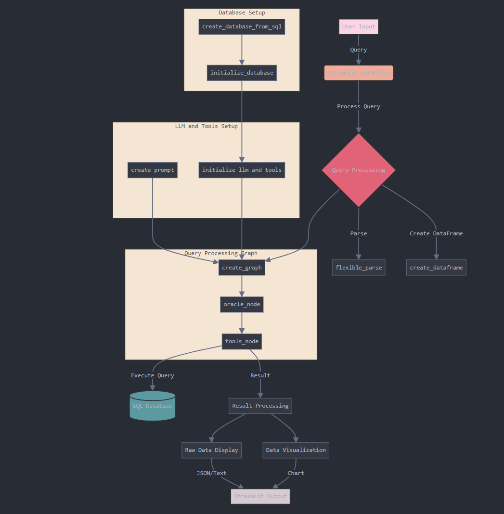

# Why Every Company Will Have an SQL AI Agent: Let’s Build One from Scratch, All Locally

Building a Local SQL AI Agent for Smarter Business Decisions


## Introduction

Full Article : [https://medium.com/@learn-simplified/why-every-company-will-have-an-sql-ai-agent-lets-build-one-from-scratch-all-locally-dd47705763f5


## What's This Project About

As data continues to grow exponentially in volume and importance, the ability to quickly and easily access insights from databases is becoming critical for businesses across industries. However, writing complex SQL queries to extract meaningful information from databases requires specialized skills that many employees lack. This is where SQL AI agents are poised to revolutionize how companies interact with their data.

Imagine you’re running a company and need quick answers from your database — like sales trends or inventory levels — without writing complex SQL queries. Today, this is possible with AI-powered SQL agents that allow users to ask questions in plain English. In this article, we’ll show you how to build a local SQL AI agent that automates data queries and makes accessing insights faster and simpler. You don’t need to be a SQL expert, and everything runs on your local system!

## Why Work on It?

SQL AI agents, also known as natural language interfaces to databases (NLIDBs), allow users to query databases using plain English rather than having to write SQL code. These AI-powered tools translate natural language questions into SQL queries, execute them against the database, and return results in an easy-to-understand format.

The technology behind SQL AI agents has made rapid progress in recent years, driven by advances in natural language processing and large language models. A 2023 study published in ACM Computing Surveys found that modern NLIDBs can achieve over 80% accuracy in translating natural language to SQL across a range of domains and database schemas

This article is about building an SQL AI agent from scratch, designed to handle database queries using natural language. Instead of spending time writing and debugging SQL code, you’ll learn how to set up a system where users simply ask questions, and the agent does the rest.

We’ll walk through the design of the system, from creating the database to integrating an AI-powered language model that converts natural language queries into SQL. The goal is to give you a practical understanding of how AI can transform the way businesses handle data.

## Architecture



# Tutorial: Local SQL AI Agent for Smarter Business Decisions

## Prerequisites
- Python installed on your system.
- A basic understanding of virtual environments and command-line tools.

## Steps

1. **Virtual Environment Setup:**
   - Create a dedicated virtual environment for our project:
   
     ```bash
     python -m venv Lets_Build_SQL_Agent_From_Scratch
     ```
   - Activate the environment:
   
     - Windows:
       ```bash
       Lets_Build_SQL_Agent_From_Scratch\Scripts\activate
       ```
     - Unix/macOS:
       ```bash
       source Lets_Build_SQL_Agent_From_Scratch/bin/activate
       ```
   
# Installation and Setup Guide

**Install Project Dependencies:**

Follow these steps to set up and run the 'Real Estate Advisory Company Using AI Agents' project:

1. Navigate to your project directory:
   ```
   cd path/to/your/project
   ```
   This ensures you're in the correct location for the subsequent steps.

2. Install the required dependencies:
   ```
   pip install -r requirements.txt
   ```
   This command installs all the necessary Python packages listed in the requirements.txt file.


## Run - SQL Agent

   ```bash 
         
      # Run SQL Agent
      streamlit run app.py
      
   ```


1. give me all customers
2. 
